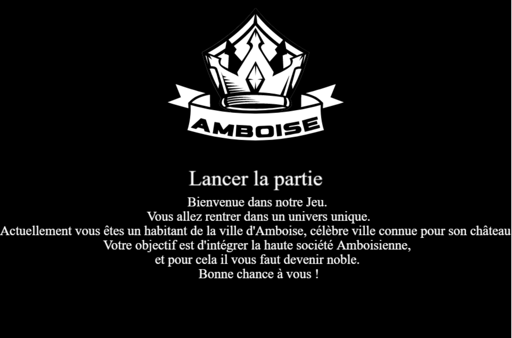

# T4

- Nom du groupe : JTVD
- Membres du groupe : 
  - ABID Julien
  - BOUDJI Djelal
  - DURIEUX Tristan
  - PETT Vincent
- Lien vers le CDC : https://docs.google.com/document/d/1kBEbKzOqdxH2LaxdPOYSaSH5yMCf-24NimNT3ag3_nw/edit?usp=sharing
- Liens vers les évaluations T4 :
  - [Jawad Amjahad](Evaluation-T4-Jawad_Amjahad.md)
  - [Fahri Cetinkaya](Evaluation-T4-Fahri_Cetinkaya.md)
  - [Justine Friedrich](Evaluation-T4-Justine_Friedrich.md)
  - [Louis Hertschuh](Evaluation-T4-Louis_Hertschuh.md)
  - [Elies Mekhinini](Evaluation-T4-Elies_Mekhinini.md)
  - [Benjamin Rota](Evaluation-T4-Benjamin_Rota.md)
  - [Julien Sumej](Evaluation-T4-Julien_Sumej.md)

## Présentation du projet

Le projet T4 est un jeu d'exploration en 2D. Le joueur incarne un chaussetier qui doit discuter avec les habitants d'Ambroise, tout en faisant divers choix afin d'augmenter son rang social et assurer la pérennité de son nom. Le joueur peut se déplacer à gauche, à droite en haut et en bas.

## Procédures d'installation et d'exécution

- Télécharger le dossier `T4_Release` sur le dépôt GitHub
- Aller dans le dossier correspondant à votre système d'exploitation
- Lancer l'exécutable

## Captures d'écran

- Ecran d'accueil

- Ecran de scène 1

- Ecran de scène 2

- Ecran de scène 3

- PNJ

- Ecran de fin

-Bulle de dialogue

